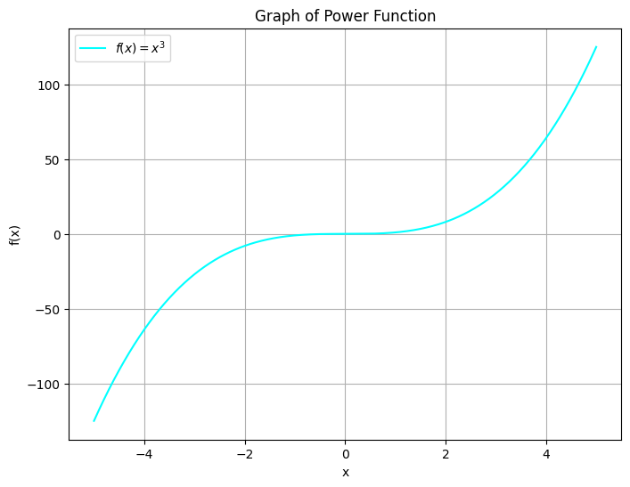
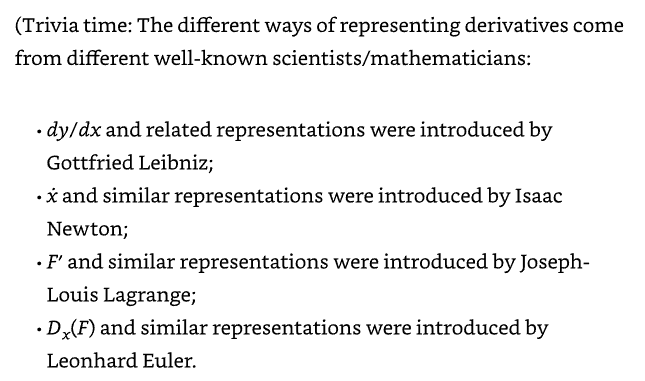
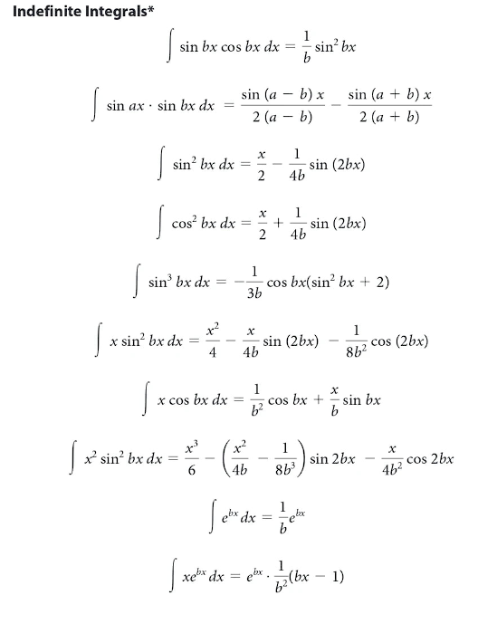

# Variables and Constants

In the physical sciences, variables and constants are fundamental concepts used to describe and quantify relationships between different quantities and phenomena.

## Variables

A variable is a quantity that can change and take on different values. In scientific experiments and observations, variables are often manipulated or measured to understand how they affect other variables. Variables are classified into independent variables and dependent variables:

> **Independent Variable**: This is the variable that is intentionally changed or controlled in an experiment. It is the presumed cause or influencing factor. Changes in the independent variable are expected to lead to changes in the dependent variable.
>
> **Dependent Variable**: This is the variable that is observed, measured, or recorded in response to changes in the independent variable. It is the outcome or result that researchers are interested in studying.

For example, in an experiment investigating the effect of temperature on the rate of a chemical reaction, temperature is the independent variable (controlled by the experimenter), and the rate of the chemical reaction is the dependent variable (measured as the outcome).

# Constants

A constant is a quantity that does not change during a particular study, experiment, or analysis. It remains the same throughout the investigation and is used as a reference point for understanding the behavior of other variables. Constants provide stability and context for interpreting changes in variables.

Constants can come in various forms:

> Physical Constants: These are universal values that remain the same regardless of the context. Examples include the speed of light (c), Planck's constant (h), the ideal gas constant (R).
>
> Experimental Constants: These are values that are assumed to be constant within the scope of a particular experiment or analysis. For instance, in a physics experiment conducted on Earth, the acceleration due to gravity (g) is typically treated as a constant even though if you were on the moon it would be significantly different.

Variables and constants are essential for describing and modeling the behavior of physical systems. Scientists use them to formulate hypotheses, design experiments, develop theories, and communicate their findings.

# Functions

A function is a rule or relationship that represents how one quantity depends on another. Functions are widely used across all STEM fields, as such there can be some confusion for students when starting out. Briefly we will discuss the formal mathematical definition of a function but then primarily focus on how we use them in the physical sciences.

## Functions (Math Perspective)

 In mathematics (and computer science), a function is a fundamental concept that describes the relationship between two sets (a list of numbers), usually called the domain (A) and the codomain (B). A function relates (→)  each element from the domain (A) to a an element in the codomain (B). It can be thought of as a "rule" or a "map" that associates each input value with a corresponding output value.

Formally, a function f from a set A (domain) to a set B (codomain) is defined as a relation that assigns to each element x in A *exactly* one element (↦) y in B. This is denoted as:

f: A → B
x ↦ y = f(x)

read the above two lines as follows:

- there is a function, f, that relates A and B
- for every value of x in f(x), there is single value of y that is mapped
  
Hence, f(x) represents the output (a value in codomain B) that corresponds to an input (a value in domain A). It's important to note that every element in the domain must have a unique output in the codomain for a function to be well-defined. In other words, no two distinct elements in the domain can be mapped to the same element in the codomain. This style of function definition is obviously used in mathematics but computer scientists, theoretical physicists and chemists also prefer this style as well.

## Functions (Physical Science Perspective)

The formal mathematical definition of a function is important, but it isn't terribly useful for for a lot of people in the physical sciences. In science, a function is a concept similar to its mathematical definition, although it is typically used in a broader context. Functions can be used to describe relationships between *variables*, *processes*, or *systems*.

In science, a function typically refers to a specific relationship or rule that governs how one variable or set of variables depends on another variable or set of variables.In this context, a function describes how changes in one quantity lead to changes in another quantity. It can represent:

- cause-and-effect relationships
- dependencies
- patterns
- fundamental rules of system
- properties of a system

For example, the ideal gas law is not a function in the traditional sense, but rather an equation that describes the relationship between the pressure (P), volume (V), and temperature (T) of an ideal gas. The equation is given by:

$$ PV = nRT $$

Where:

- P is the pressure of the gas,
- V is the volume of the gas,
- n is the number of moles of the gas,
- R is the ideal gas constant, and
- T is the temperature of the gas in Kelvin.

This equation expresses how these properties are related when dealing with an ideal gas under a wide range of conditions.

It's important to note that the ideal gas law (in this form) does not represent a well-defined function in the traditional mathematical sense because it doesn't map a single input value to a unique output value. Instead, it provides a relationship between the variables in the equation.

While the ideal gas law itself is not a function, it can be used to derive specific relationships or functions. For example, you can rearrange the ideal gas law to solve for pressure as function of volume, moles and temperature.

$$ P = \frac{nRT}{V} $$
sometimes this will or more formally presented:
$$ let~P = f(n,T,V) $$
$$ P = \frac{nRT}{V}$$

which can be read as 
>*let the pressure be represented by a function of three variables: n, T and V. The algebraic form of the function is ...*.

Notice that only variables are placed within the parenthesis of the function definition, constants (in this case R) do not appear there.

# Common Functions in Physical Science

Functions in science can be represented *mathematically* and *graphically* (sometimes in other ways). Depending on the nature of the relationship being studied one form may be more appropriate than the other. However, all physical scientists should be familiar with both forms of the most commonly encountered functions. In the physical sciences, various functions are encountered that describe relationships between different quantities and phenomena. Some common types of functions include:

- Linear Functions
- Quadratic Functions
- Exponential Functions
- Logarithmic Functions
- Trigonometric Functions
- Power Functions
- Power Series* (special)
- Polynomial Functions* (special)
- Gaussian Functions
  
A brief description of how these functions are used and their general the mathematical and graphical form follows.

## Linear Functions
 They are often used to describe proportional relationships, such as distance vs. time for constant velocity motion.
A linear function has the form:

$$ f(x)=mx+b $$

where,

- m is the slope of the line
- b is the y-intercept (the point where the line crosses the y-axis).

You have probably encountered this form of a linear function in your highschool algebra classes:

$$ y=mx+b $$

 These functions have a constant rate of change and result in a straight-line graph. The graph of a linear function is always straight line.

## Quadratic Functions

 These functions involve a squared term and typically result in a parabolic graph. They are encountered in projectile motion, parabolic trajectories, and various physical systems exhibiting quadratic behavior.

 A quadratic function has the form:

$$ f(x) = ax^2 + bx + c $$

where,

- a,b and c are coefficients.

 

## Exponential Functions

 Exponential functions involve a constant raised to a variable exponent leading to *rapid* growth or decay. These functions model phenomena like population growth, radioactive decay, and exponential charging/discharging of electrical circuits.

 An exponential function has the form:

$$ f(x) = e^x  $$

 

## Logarithmic Functions

 These functions are the *inverse* of exponential functions and describe how one quantity varies with the logarithm of another. Inverse functions "undo" the action of another function. In the physical sciences, they are used to describe the inverse relationship between quantities.
They will show a fairly rapid growth/decay pattern that levels off to a stable unchanging value, given enough "time". They are used in various contexts, such as pH in chemistry or signal strength in telecommunications.

A logarithmic function has the form:

$$ f(x) = log_{b}(x)  $$

where b is the base of the logathrim.

A special case of a logathrim with the base e (euler's number, it's like $ \pi $ but better) is known as the natural log (ln):

$$ f(x) = log_{e}(x) = ln(x)  $$

Both of these forms follow the same patterns and rules and they can be converted from one form to another.

$$ ln(x) = log_{10}(e)\cdot log_{10}(x) = 2.303\cdot log_{10}(x)  $$
$$ log_{10}(x) = \frac{ln(x)}{log_{10}(e)} = \frac{ln(x)}{2.303}  $$

 The natural log crops up in equations without any special effort (hence the term *natural*) so you will frequently see natural logs physical chemistry.

 

## Trigonometric Functions

 Sine, cosine, and tangent functions (and their inverses) describe relationships involving angles and distances in triangles or *periodic phenomena*, like waveforms and oscillations. The primary trigonometric functions include:

- Sine - sin(x)
- Cosine - cos(x)
- Tangent - tan(x)
- Cosecant - csc(x)
- Secant - sec(x)
- Cotangent - tan(x)

All trigonometric functions have their own inverse functions, in modern settings the "arc-" prefix  will indicate if the function is a trigonometric inverse. 

- Arcsine - arcsin(x)
- Arccosine - arccos(x)
- Arctangent - arctan(x)
- Arccosecant - arccsc(x)
- Arcsecant - arcsec(x)
- Arccotangent - arctan(x)

Unfortunately, history has resulted in several different naming conventions for inverse trig functions, for example, the sin(x) inverse function can be written as arcsin(x), sin$^{-1}$(x) or even Sin(x). This makes an already confusing subject for students just more confusing. Sorry!

These functions are typically defined using the ratios of sides in a right triangle (opposite over hypotenuse, etc...), but their definitions can be extended to the entire real number line through the unit circle and various trigonometric identities. The triangle based definitions that you learned in your trigonometry functions are still very true. They just are as useful for the practicing physical scientist. The main reason we concern ourselves with trigonometric functions is these are best functions at describing any observations that are periodic in nature. Thus their graphical form is far more important to us most of the time,

 

## Power Functions

 A power function is a function with a single term that is the product of a real number, a coefficient, and a variable raised to a fixed real number. They exhibit behaviors ranging from polynomial-like to exponential-like, depending on the value of the exponent. They are very useful but under certain circumstances it can be easy to misidentify these functions from graphical inspection.

A power function has the form:

$$ f(x) = a_n x^n  $$

where $a_n$ and n are real numbers. The value of the n exponent has a large effect on the graphical representations of power functions. If n is an even number,

 

if n is an odd number,

 

## Power Series

A power series is an infinite series of power functions that represents a function as a sum of terms involving powers of a variable. It's a way to express a function as an infinite sum of terms that look like $a_nx^n$, where the coefficients can vary. The general form of a power series is:
$$ f(x) = \sum_{n=0}^{\infty} a_n x^n  $$

Power series can have graphs of nearly every possible shape on the terms present in the function. Without further specifying the specific function it hard to provide illustrative examples.

## Polynomial Functions

A polynomial function is a mathematical function that is defined as a sum of terms, each of which is a constant multiplied by a variable raised to a non-negative integer exponent. These functions are also reffered to as power series in some areas. In other words, a polynomial function is a combination of powers of a variable, and the terms are added or subtracted to create the overall function.

The general form of a polynomial function is:

$$ f(x) = a_nx^n + a_{n-1}x^{n-1} + ... + a_2x^2 + a_1x + a_0 $$

Where:

- f(x) represents the polynomial function.
- x is the variable.
- n is a non-negative integer representing the highest degree of the polynomial.
- $a_n$, $a_{n-1}$ , ..., $a_2$, $a_1$, $a_0$ are coefficients, with $a_n \not ={} 0$, that multiply the  corresponding powers of x.

Polynomial functions can have various degrees. We have already discussed two of them: the linear function and quadratic function. For example:

- A linear polynomial has a degree of 1: $f(x) = ax + b$.
- A quadratic polynomial has a degree of 2: $f(x) = ax^2 + bx + c$.
- A cubic polynomial has a degree of 3: $f(x) = ax^3 + bx^2 + cx + d$.

And so on, with higher degrees corresponding to higher powers of x.

Polynomial functions are essential in various mathematical and scientific contexts. They are used to approximate more complex functions, model data, solve equations, and describe a wide range of phenomena.

Polynomial functions can have graphs of nearly every possible shape depending on the number of terms in the function. Without further specifying the specific polynomial function it hard to provide illustrative examples.

### Differences Between Polynomial Functions and Power Series

Polynomial functions and power series are almost identical and there is no need to distinguish between the two most of the time. However, they do have a few differences:

1. Degree vs. Infinite Terms: Polynomials have a finite number of terms, while power series have an infinite number of terms.

2. Function Representation: Polynomials represent functions using a finite number of terms, whereas power series can represent a broader range of functions, including non-polynomial functions, such as trig functions.

3. Radius of Convergence: Power series have a concept called the "radius of convergence," which determines the interval of x values for which the series converges. This concept doesn't apply to polynomials.

## Gaussian (Normal) Functions

 This is a common (very, very common) function that describes the distribution of data points around a mean value. It's encountered in various statistical and physical contexts.

A gaussian function has the general form:

$$ f(x) = a\cdot e^{-x^2}  $$

where a is a coefficient.

 

### Special Note on Gaussian Functions

Gaussian functions are often used to represent the probability density function of a normally distributed random variable, and they will take an slightly different form (with more variables and constants) when encountered in this context:

$$ f(x) = \frac{1}{\sigma \sqrt{2\pi}}\cdot exp{\left(-\frac{1}{2}\frac{(x-\mu)^2}{\sigma^2}\right)}  $$

where $\sigma$ is the standard deviation, $\mu$ is the expected value (average typically). The exp term simply represents Euler's number raised to everything in the parentheses but with large exponents the font becomes hard to read. Don't worry too much about this form unless you are in statistic's this semester.

### Can Functions Have More Than One Type?

Yes

# Derivatives and Integrals of Functions

A derivative is a fundamental concept in calculus that represents the rate of change of a function with respect to its input variable. In simpler terms, it tells us how much a function's output value changes when its input value changes slightly. The derivative of a function at a specific point gives us the instantaneous rate of change of the function at that point.

Mathematically, if you have a function f(x), the derivative f'(x) (also denoted as $\frac{dx}{df}$) represents the slope of the tangent line to the curve of the function at a given point x. It can be thought of as the "steepness" of the curve at that point.

| Function                | Derivative                               |
|:------------------------:|-----------------------------------------:|
|  \(c\) (constant)        | \( \frac{d}{dx}(c) = 0 \)                |
| \(x^n\)                 | \( \frac{d}{dx}(x^n) = nx^{n-1} \)       |
| \(e^x\)                 | \( \frac{d}{dx}(e^x) = e^x \)            |
| \(a^x\) (a > 0)         | \( \frac{d}{dx}(a^x) = a^x \ln(a) \)     |
| \(\ln(x)\)              | \( \frac{d}{dx}(\ln(x)) = \frac{1}{x} \) |
| \(\sin(x)\)             | \( \frac{d}{dx}(\sin(x)) = \cos(x) \)   |
| \(\cos(x)\)             | \( \frac{d}{dx}(\cos(x)) = -\sin(x) \)  |
| \(\tan(x)\)             | \( \frac{d}{dx}(\tan(x)) = \sec^2(x) \) |
| \(\cot(x)\)             | \( \frac{d}{dx}(\cot(x)) = -\csc^2(x) \)|
| \(\sec(x)\)             | \( \frac{d}{dx}(\sec(x)) = \sec(x) \tan(x) \) |
| \(\csc(x)\)             | \( \frac{d}{dx}(\csc(x)) = -\csc(x) \cot(x) \) |
| \(\arcsin(x)\)          | \( \frac{d}{dx}(\arcsin(x)) = \frac{1}{\sqrt{1 - x^2}} \) |
| \(\arccos(x)\)          | \( \frac{d}{dx}(\arccos(x)) = -\frac{1}{\sqrt{1 - x^2}} \) |
| \(\arctan(x)\)          | \( \frac{d}{dx}(\arctan(x)) = \frac{1}{1 + x^2} \) |
| \(\sinh(x)\)            | \( \frac{d}{dx}(\sinh(x)) = \cosh(x) \) |
| \(\cosh(x)\)            | \( \frac{d}{dx}(\cosh(x)) = \sinh(x) \) |
| \(\tanh(x)\)            | \( \frac{d}{dx}(\tanh(x)) = \text{sech}^2(x) \) |
| \(\coth(x)\)            | \( \frac{d}{dx}(\coth(x)) = -\text{csch}^2(x) \) |
| \(\text{sech}(x)\)      | \( \frac{d}{dx}(\text{sech}(x)) = -\text{sech}(x) \tanh(x) \) |
| \(\text{csch}(x)\)      | \( \frac{d}{dx}(\text{csch}(x)) = -\text{csch}(x) \coth(x) \) |
| \(\text{arsinh}(x)\)    | \( \frac{d}{dx}(\text{arsinh}(x)) = \frac{1}{\sqrt{x^2 + 1}} \) |
| \(\text{arccosh}(x)\)   | \( \frac{d}{dx}(\text{arccosh}(x)) = \frac{1}{\sqrt{x^2 - 1}} \) |
| \(\text{arctanh}(x)\)   | \( \frac{d}{dx}(\text{arctanh}(x)) = \frac{1}{1 - x^2} \) |

| Function                | Integral                               |
|-------------------------|----------------------------------------|
| \(c\) (constant)           | \( \int c \, dx = cx + C \)              |
| \(x^n\) (n ≠ -1)        | \( \int x^n \, dx = \frac{x^{n+1}}{n+1} + C \) |
| \( \frac{1}{x} \) (x ≠ 0) | \( \int \frac{1}{x} \, dx = \ln(\lvert x \rvert) + C \)  |
| \(e^x\)                 | \( \int e^x \, dx = e^x + C \)            |
| \(a^x\) (a > 0, a ≠ 1)  | \( \int a^x \, dx = \frac{a^x}{\ln(\lvert a \rvert)} + C \) |
| \( \sin(x) \)           | \( \int \sin(x) \, dx = -\cos(x) + C \)    |
| \( \cos(x) \)           | \( \int \cos(x) \, dx = \sin(x) + C \)     |
| \( \tan(x) \)           | \( \int \tan(x) \, dx = -\ln(\lvert \cos(x) \rvert) + C \) |
| \( \sec^2(x) \)         | \( \int \sec^2(x) \, dx = \tan(x) + C \)    |
| \( \csc^2(x) \)         | \( \int \csc^2(x) \, dx = -\cot(x) + C \)   |
| \( \frac{1}{x^2 + 1} \) | \( \int \frac{1}{x^2 + 1} \, dx = \arctan(x) + C \) |
| \( \frac{1}{\sqrt{1 - x^2}} \) | \( \int \frac{1}{\sqrt{1 - x^2}} \, dx = \arcsin(x) + C \) |
| \( \frac{1}{\sqrt{x^2 + 1}} \) | \( \int \frac{1}{\sqrt{x^2 + 1}} \, dx = \text{arsinh}(x) + C \) |
| \( \frac{1}{\sqrt{x^2 - 1}} \) | \( \int \frac{1}{\sqrt{x^2 - 1}} \, dx = \text{arcosh}(x) + C \) $\quad$ (x > 1) |
| \( \frac{1}{1 - x^2} \) | \( \int \frac{1}{1 - x^2} \, dx = \arctan(x) + C \quad \text{if } \lvert x \rvert < 1 \) |

# Differential Equations

# Multivariate Functions

# System, Surroundings, and State

# The Zeroth Law

# Equations of State

# Partial Derivatives

# Important (Named) Partial Derivatives 

# Molecular Thermodynamics vs Classical Thermodynamics

# The First Law

# Limits of the First Law

